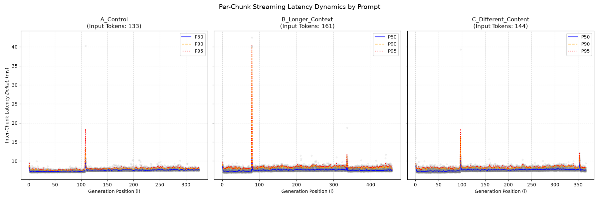
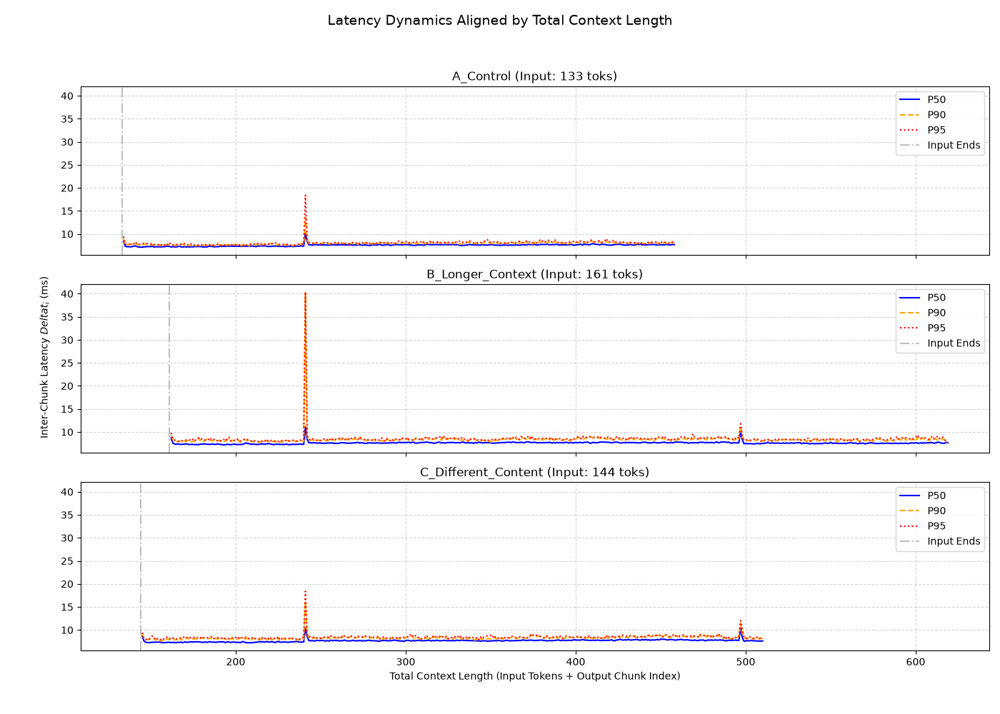

# Experiment 3: Context-Position-Dependent Latency Transitions

## 1. Research Question
In Experiment 2, we observed a deterministic latency spike and a permanent step-up in inter-chunk latency during autoregressive decoding. This experiment aims to identify which observable variable most strongly controls the anomaly under the evaluated configuration. Specifically, we investigate whether the latency spikes are triggered by:
1.  **Output Position:** Bound to a specific generation step (e.g., generating the 100th chunk).
2.  **Content:** Triggered by specific string patterns or tokenization boundaries (e.g., specific JSON syntax or line breaks).
3.  **Total Context Length:** Bound to the cumulative sum of input tokens and generated chunks.

## 2. Methodology
We designed an orthogonal test (`prompt_variance.py`) suite using three distinct prompts to separate input length from content:
*   **Prompt A (Control):** Baseline evaluation prompt (Estimated Input: 133 tokens).
*   **Prompt B (Longer Context):** Same task as A, but with added padding in the system instructions (Estimated Input: 161 tokens).
*   **Prompt C (Different Content):** Evaluating a different vocabulary word to alter the generated output string (Estimated Input: 144 tokens).

**Controlled Variables:**
*   Hardware: NVIDIA GeForce RTX 5070 Ti
*   Model: `Meta-Llama-3-8B-Instruct-Q4_K_M.gguf` via `llama.cpp`
*   Decoding Parameters: `temperature = 0.0` (Greedy decoding)
*   Runs: 20 repeated iterations per prompt

We aligned the visualization of inter-chunk latency ($\Delta t_i$) using **Total Context Length** (Input Tokens + Output Chunk Index) on the X-axis, rather than just the generation step.

## 3. Observations

### 3.1 Spike Alignment (`analyze_spike.py`)
When plotted against Total Context Length, the first persistent transition aligned at the same nominal total-context position across the three evaluated prompts.

| Prompt Type         | Input Tokens | Spike 1 Chunk Index | Spike 1 Total Context | Spike 2 Chunk Index | Spike 2 Total Context |
|---------------------|--------------|---------------------|-----------------------|---------------------|-----------------------|
| A_Control           | 133          | 108                 | **241**               | N/A (Run ended)     | N/A                   |
| B_Longer_Context    | 161          | 80                  | **241**               | 336                 | **497**               |
| C_Different_Content | 144          | 97                  | **241**               | 353                 | **497**               |

**Conclusion:** These results are inconsistent with a fixed output-position explanation and are not explained by the visible identity of the generated token in the evaluated prompts. They support nominal total context position as the primary observed controlling variable.

### 3.2 Periodicity and The 256-Token Interval
The distance between the two observed spikes (497 - 241) is exactly **256**.
While the first spike occurs at an observed total context of 241, we hypothesize that the missing ~15 tokens are due to hidden overhead from the LLM chat template (e.g., injected role markers like `<|start_header_id|>user<|end_header_id|>`). The two observed event locations are separated by exactly 256 nominal context positions. This periodicity is consistent with a runtime-state boundary. One possible explanation is a fixed offset introduced by prompt formatting or special tokens, which could map the nominal positions 241 and 497 to internal positions near 256 and 512.

A KV-cache or memory-management boundary is therefore a candidate mechanism, but this experiment does not directly observe runtime token accounting, KV-cache allocation, or GPU memory events. Establishing that mechanism requires runtime-level instrumentation.

### 3.3 Post-Spike Latency Shifts (`step_up_multi.py`)
We conducted a step-up analysis on the P50 median latencies using a clean window before and after each spike to observe any persistent shifts in inference speed. The following table summarizes the raw measurements and the percentage change for each prompt and boundary crossing:

| Prompt | Spike Type (Context Boundary) | Before P50 (ms) | After P50 (ms) | Delta (ms) | Change (%) |
| :--- | :--- | :--- | :--- | :--- | :--- |
| A_Control | Spike 1 (~256 tokens) | 7.3230 | 7.6289 | +0.3059 | **+4.18%** |
| B_Longer_Context | Spike 1 (~256 tokens) | 7.3296 | 7.5814 | +0.2519 | **+3.44%** |
| C_Different_Content| Spike 1 (~256 tokens) | 7.3901 | 7.6783 | +0.2881 | **+3.90%** |
| B_Longer_Context | Spike 2 (~512 tokens) | 7.7283 | 7.5467 | -0.1816 | **-2.35%** |
| C_Different_Content| Spike 2 (~512 tokens) | 7.7627 | 7.6254 | -0.1373 | **-1.77%** |

**Observation 1: The First Step-Up (~256 Boundary)**

After the first spike (crossing the ~256 total context boundary), we observed a highly consistent latency **increase** (Step-up) across all runs. The P50 latency degraded by approximately +3.4% to +4.2%. This suggests a sustained overhead, possibly due to traversing an additional memory block during the continuous attention computation.

**Observation 2: The Second Step-Down (~512 Boundary)**

Unexpectedly, when crossing the second spike (~512 total context boundary in Prompts B and C), the median latency showed a slight **decrease** (Step-down) of roughly -1.7% to -2.4% compared to its immediate pre-spike plateau (though still higher than the initial <256 context baseline).

## 4. Open Questions & Future Work
The observed 256-position periodicity motivates a KV-cache or runtime-memory-management hypothesis, but the present experiment establishes correlation rather than mechanism.

Potential factors could involve L1/L2 cache locality behaviors, hardware prefetching thresholds, or other low-level OS memory paging mechanisms. We leave the root-cause analysis of this specific step-down phenomenon for future investigation.