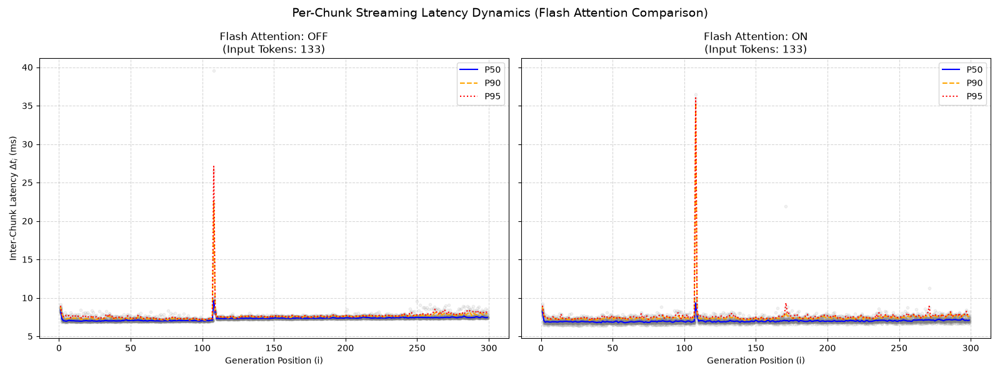
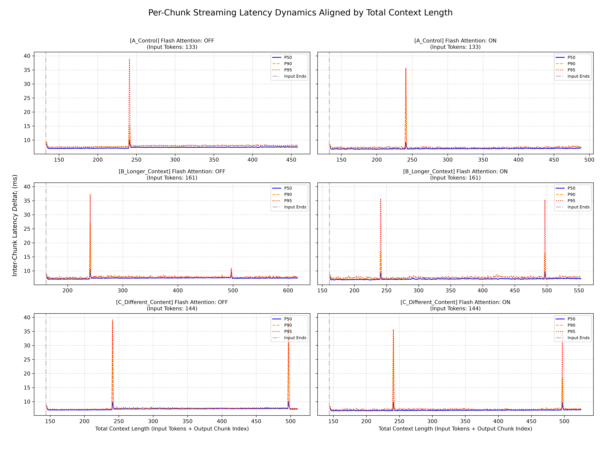

# 實驗四：Flash Attention 對上下文相依延遲之干預分析

## 1. 研究問題
在實驗三中，我們觀察到兩個與特定總上下文邊界（大約每 256 個 Token）相關的顯著延遲現象：
1. 短暫但巨大的延遲突刺 (Transient latency spike)。
2. 首次突刺後，基礎跨區塊延遲 (Base inter-chunk latency) 發生持續性的階梯式墊高 (Persistent step-up)。

本實驗旨在探討這兩個現象是否與標準注意力機制執行路徑的記憶體存取開銷 (Memory-access overhead) 有關。我們透過啟用 Flash Attention (FA) 進行干預——這是一種切磚注意力演算法 (Tiled attention algorithm)，旨在減少中間記憶體傳輸並提高記憶體效率。透過在其他條件相同的情況下比較 FA-ON 與 FA-OFF，我們檢驗 Flash Attention 是否會改變：
- 短暫突刺發生的位置與幅度
- 跨越邊界後，基準解碼延遲的持續性階梯式墊高現象。

核心目標在於釐清：突刺與持續性的階梯式墊高，對於相同的注意力層級干預是否會產生不同的反應。

## 2. 研究方法

### 2.1 干預變數
在 `llama-cpp-python` 中的 `flash_attn` 標記在以下兩者間切換：
*   FA OFF：標準注意力機制執行路徑
*   FA ON：Flash Attention 執行路徑

### 2.2 控制變數
本實驗在實驗三的三個正交提示詞上進行了複製測試：
*   A_Control, B_Longer_Context, C_Different_Content
*   硬體：NVIDIA GeForce RTX 5070 Ti
*   模型：透過 `llama.cpp` 執行的 `Meta-Llama-3-8B-Instruct-Q4_K_M.gguf`
*   解碼參數：`temperature = 0.0` (貪婪解碼)
*   執行次數：每個提示詞重複執行 20 次 (Runs)

在 FA-ON 與 FA-OFF 的條件下，硬體、模型、執行期設定與生成參數皆保持一致。此設計使我們能確認所觀察到的效應，是否在輸入長度與生成內容不同的情況下依然成立。

### 2.3 評估指標
我們評估以下指標：
1. **突刺位置 (Spike location)：** 短暫延遲突刺發生時的總上下文 (Total context) 位置。
2. **突刺幅度 (Spike magnitude)：** 於突刺區間內測量到的 P50 延遲。
3. **基準延遲 (Baseline latency)：** 在相關邊界前後的穩定區間內測量到的 P50 延遲。
4. **階梯式增量 (Step-up delta)：** 跨邊界後與跨邊界前的基準 P50 延遲差異。

主要的比較基準為 FA-OFF 與 FA-ON 條件下，階梯式增量 (Step-up delta) 的變化。

## 3. 觀察結果

### 3.1 突刺位置保持不變
啟用 Flash Attention 並未改變主要延遲突刺發生的生成位置。

| 提示詞類型 | 突刺 1 總上下文 | 突刺 2 總上下文 | FA OFF 突刺 P50 | FA ON 突刺 P50 |
| :--- | :--- | :--- | :--- | :--- |
| **A_Control** | 241 | N/A | 10.07 ms | 9.09 ms |
| **B_Longer_Context** | 241 | 497 | 10.58 ms | 9.31 ms |
| **C_Diff_Content** | 241 | 497 | 9.69 ms | 9.68 ms |

**觀察結果：** 無論在 FA-OFF 或 FA-ON 條件下，主要突刺依然與總上下文位置 241 和 497 保持對齊。

因此，Flash Attention **似乎並未改變**所觀察之突刺的觸發位置。在提示詞 A 與 B 中，FA 條件下的絕對突刺幅度略低，但在提示詞 C 中則幾乎保持不變。由此可知，此干預手段在某種程度上會影響突刺幅度，但並未消除該事件或改變其觀測位置。這項區別至關重要：**儘管 Flash Attention 可能會適度降低突刺的幅度，但它並未消除該短暫突刺。**

### 3.2 突刺後階梯式墊高現象的緩解
與持續存在的突刺本身相反，Flash Attention 大幅降低了越過第一個上下文邊界後，持續性的延遲增加現象。

**第一邊界（總上下文約 256）P50 延遲變化：**

| 提示詞 | FA 狀態 | 邊界前 P50 | 邊界後 P50 | 階梯式增量 | 緩解效果 |
| :--- | :--- | :--- | :--- | :--- | :--- |
| A | OFF | 7.1166 ms | 7.4284 ms | **+0.3118 ms** | - |
| A | ON  | 6.8503 ms | 6.8683 ms | **+0.0180 ms** | **減少 94.2%** |
| B | OFF | 7.0560 ms | 7.3837 ms | **+0.3277 ms** | - |
| B | ON  | 6.8791 ms | 6.9935 ms | **+0.1144 ms** | **減少 65.1%** |
| C | OFF | 7.0641 ms | 7.3768 ms | **+0.3127 ms** | - |
| C | ON  | 6.7856 ms | 6.8581 ms | **+0.0725 ms** | **減少 76.8%** |

**觀察結果**：Flash Attention 降低了初始解碼基準延遲（從約 7.1ms 降至約 6.8ms），並強力壓制了後續的階梯式墊高懲罰 (Step-up penalty)；此現象在三個提示詞中皆然，儘管緩解的幅度有所不同。

這些結果提供了有力的證據，證明持續性的階梯式墊高現象對注意力機制的執行策略具備敏感性，且極可能與記憶體存取或記憶體頻寬成本有關，而這正是 Flash Attention 能夠降低的部分。

### 3.3 第二邊界行為（總上下文長度約 512）
提示詞 B 與 C 在總上下文約 497 處也包含了第二個主要突刺。越過此第二邊界後的行為，與第一邊界所觀察到的狀況有所不同：

| 提示詞 | FA 狀態 | 邊界前 P50 (突刺 2) | 邊界後 P50 (突刺 2) | 階梯式增量 |
| :--- | :--- | :--- | :--- | :--- |
| B | OFF | 7.5378 ms | 7.3441 ms | **-0.1937 ms** (階梯式下降 Step-down) |
| B | ON  | 7.1619 ms | 7.2344 ms | **+0.0725 ms** (微幅上升 Slight step-up)|
| C | OFF | 7.5319 ms | 7.3400 ms | **-0.1919 ms** (階梯式下降 Step-down) |
| C | ON  | 6.9903 ms | 7.0769 ms | **+0.0866 ms** (微幅上升 Slight step-up)|

**觀察結果**：在未啟用 Flash Attention 的情況下，跨越第二邊界會伴隨測量基準延遲的小幅下降。而在啟用 Flash Attention 後，此現象轉變為小幅上升。

我們記錄了此分歧現象，但不將其作為實驗四主要結論的證據。第二邊界的行為在定性上似乎與第一邊界的持續性階梯式墊高有所不同，需要獨立的研究調查。因此，實驗四的主要干預結果是基於第一邊界所奠定，因為在該邊界上，FA-OFF/FA-ON 的差異在所有三個提示詞中皆保持一致。

## 4. 結論
實驗四揭示了實驗三所觀察到的兩個延遲現象之間，存在著重要的物理機制分離 (Separation)。

### 4.1 Flash Attention 緩解了邊際成本退化
在所有三個提示詞中，啟用 Flash Attention 實質上減少了越過第一個上下文邊界後，基準跨區塊解碼延遲的持續性增加。測量到的墊高降幅介於約 65% 至 94% 之間。這提供了有力的證據，表明該持續性墊高與注意力執行路徑中的運算或記憶體存取成本有關，而該成本對於 Flash Attention 的記憶體高效執行策略具備敏感度。

然而，本實驗本身並未確立導致此墊高現象的確切底層機制。需進行 Kernel 層級的效能分析 (Kernel-level profiling) 或原始碼層級的分析，方能建立精確的因果機制。

### 4.2 短暫突刺的行為特徵與持續性墊高不同
在 FA-OFF 與 FA-ON 條件下，短暫突刺依然與總上下文位置 241 和 497 保持對齊。儘管 FA 在某些提示詞中適度降低了突刺幅度，但它 **並未** 消除突刺；未改變其觀測到的觸發位置；也未能產生如針對持續性墊高般強烈的緩解效果。

因此，實驗結果指出：短暫的突刺與突刺後持續性的階梯式墊高，極有可能是由至少部分獨立的不同機制所支配。

具體而言，在啟用 Flash Attention 後，對齊上下文邊界的突刺依然存在，這暗示了它不單純只是標準注意力實作中記憶體頻寬開銷 (Memory-bandwidth overhead) 的產物。這項結果為後續針對「控制突刺本身之因素」進行獨立研究提供了強烈的動機。