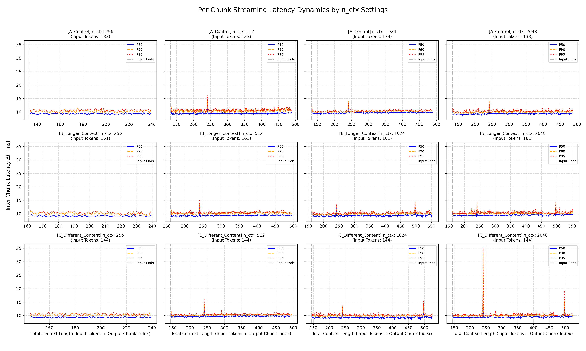
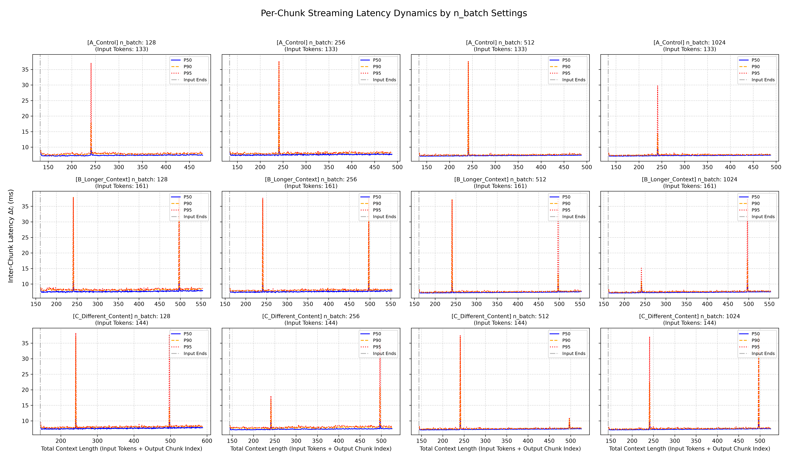
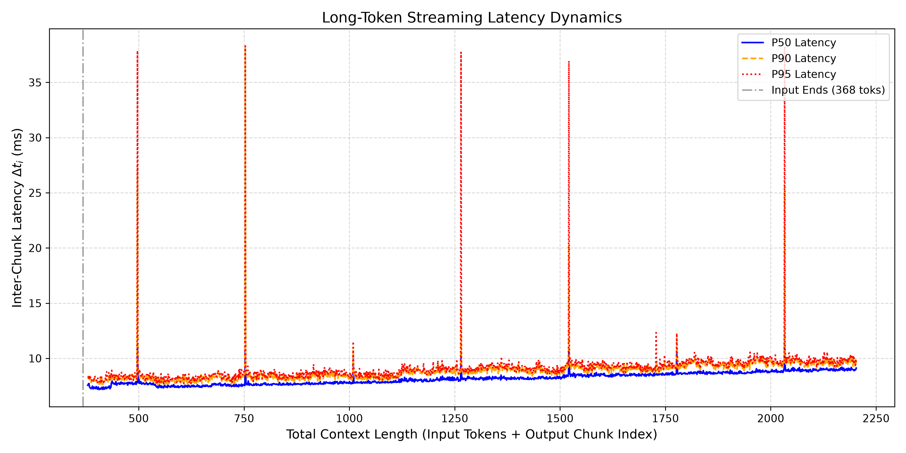

# Experiment 5: System Parameter Ablation and Long-Context Dynamics

## 1. Research Question
In previous experiments, we identified a deterministic latency spike and a step-up pattern tied strictly to the Total Context Length boundary (~256 tokens). This experiment aims to narrow down the possible causes by answering:
1. Do runtime configurations (`n_ctx` or `n_batch`) dictate the position of these spikes?
2. Does the spike periodicity persist into much longer sequences (>1000 tokens)?
3. With Flash Attention (FA) enabled, does the base decoding latency (TPOT) remain perfectly constant over long sequences, or does it still scale with context length?

## 2. Methodology
- **Intervention Strategy:** One-Factor-At-A-Time (OFAT) parameter ablation.
- **Fixed Variables:** Hardware (RTX 5070 Ti), Model (`Meta-Llama-3-8B-Instruct-Q4_K_M`), Flash Attention = `ON`, `temperature = 0.0`
- **Runs:** All phases have 20 repeated iterations per swept and per prompt.
- **Phase 1 (`n_ctx` ablation):** Swept `n_ctx` across `[256, 512, 1024, 2048]`. Using Prompt A, B and C shown in previous experiments.
- **Phase 2 (`n_batch` ablation):** Swept `n_batch` across `[128, 256, 512, 1024]`. Using Prompt A, B and C shown in previous experiments.
- **Phase 3 (Long Context Test):** Extended `max_tokens` to ~2000 to observe long-term streaming dynamics and periodicity. Using a new prompt. (`LONG_PROMPT`)

## 3. Observations

### 3.1 Spike Location is Invariant to `n_ctx`
We hypothesized that the allocated maximum context size (`n_ctx`) might dictate memory block boundaries. Testing across multiple prompts showed that varying `n_batch` from 512 to 2048 did not shift the spike positions.
>   When `n_ctx=256`, no spike was observed because generation truncated before the boundary. For all other values, the spike locations remained rigidly fixed at Total Context = 241 and 497.

>   The following data only shows the results of Prompt A

| Experiment Config | Input Toks | Spike Chunk | Total Ctx | Spike P50 |
| :--- | :--- | :--- | :--- | :--- |
| **n_ctx: 512** | 133 | 108 | **241** | 12.28 ms |
| **n_ctx: 1024** | 133 | 108 | **241** | 13.13 ms |
| **n_ctx: 2048** | 133 | 108 | **241** | 12.94 ms |

**Conclusion:** The observed spike location is invariant across the tested `n_ctx` configurations.



### 3.2 Spike Location is Invariant to `n_batch`
We hypothesized that the prompt processing/generation batch size (`n_batch`) might trigger synchronization boundaries. Testing across multiple prompts showed that varying `n_batch` from 128 to 1024 did not shift the spike positions.
>   The following data only shows the results of Prompt B's first spike

| Experiment Config | Input Toks | Spike Chunk | Total Ctx | Spike P50 |
| :--- | :--- | :--- | :--- | :--- |
| **n_batch: 128** | 161 | 80 | **241** | 10.68 ms |
| **n_batch: 256** | 161 | 80 | **241** | 10.36 ms |
| **n_batch: 512** | 161 | 80 | **241** | 10.27 ms |
| **n_batch: 1024** | 161 | 80 | **241** | 9.67 ms |

**Conclusion:** The observed spike location is invariant across the tested `n_batch` configurations.



### 3.3 Strict 256-Token Periodicity in Long Context
By extending the generation length to ~1800 chunks, we observed a perfectly repeating pattern of latency spikes.

| Spike Index | Total Context | Distance from Prev. Spike | Spike P50 |
| :--- | :--- | :--- | :--- |
| Spike 1 | 497 | - | 11.14 ms |
| Spike 2 | 753 | **256** | 10.60 ms |
| Spike 3 | 1009 | **256** | 10.07 ms |
| Spike 4 | 1265 | **256** | 10.33 ms |
| Spike 5 | 1521 | **256** | 10.97 ms |
| Spike 6 | 1777 | **256** | 10.73 ms |
| Spike 7 | 2033 | **256** | 11.53 ms |

>   **Note:** The long-context workload used an input of 368 tokens. Therefore, the initial spike previously observed at Total Context = 241 was outside the observable range of this experiment.

**Conclusion:** The extended experiment demonstrates an exact 256-token recurrence of the observed latency spike after the initial event at Total Context = 241. The invariance across the tested `n_ctx` and `n_batch` configurations suggests that the periodicity is governed by a lower-level mechanism not directly exposed by these parameters. A fixed-granularity memory-management or KV-cache mechanism is a plausible explanation, but the present experiment does not directly observe memory allocation, paging, cache-management events, or the corresponding CUDA operations.

### 3.4 Long-Term TPOT Degradation (Even with Flash Attention)
In Experiment 4, Flash Attention substantially mitigated the persistent step-up observed after the first spike. However, the extended long-context experiment reveals a different phenomenon: a gradual increase in the baseline decoding latency as the context grows.

| Spike Context Boundary | Before P50 (ms) | After P50 (ms) | Step Delta (ms) |
| :--- | :--- | :--- | :--- |
| 497 | 7.7442 | 7.7244 | -0.0199 ms |
| 753 | 7.5162 | 7.6275 | +0.1113 ms |
| 1009 | 7.7997 | 7.7965 | -0.0032 ms |
| 1265 | 8.0940 | 8.1819 | +0.0879 ms |
| 1521 | 8.3213 | 8.4739 | +0.1526 ms |
| 1777 | 8.6067 | 8.6381 | +0.0313 ms |
| 2033 | 8.8103 | 8.9290 | +0.1187 ms |

>   From approximately Context 500 to Context 2000, the median Time Per Output Token (TPOT) showed a gradual upward trend from approximately **7.5 ms** to **8.9 ms**. The long-context trace also shows a short early plateau around the first observable boundary near 500 tokens before the longer-term upward trend resumes.

**Analysis:** The boundary-to-boundary step deltas are small and inconsistent in sign. This suggests that the dominant long-context effect is not a fixed persistent step-up at every 256-token boundary, but rather a gradual context-dependent increase in baseline decoding latency.

**Conclusion:** While Flash Attention substantially suppresses the persistent step-up observed in earlier experiments, it does not eliminate the context-dependent increase in decoding latency. The observed gradual degradation is consistent with increasing computational and memory-access costs associated with attention over a growing KV cache.




## 4. Secondary Observations and Unresolved Phenomena
Several secondary behaviors were observed during the long-context experiment. These are documented for completeness but are not treated as primary causal findings.

### 4.1 Initial Decoding Transient
The first few decoding chunks exhibit distinct latency behavior before entering the longer-term trend. This may reflect initialization effects, prompt-to-generation transition behavior, or other framework/runtime state changes. The present experiment does not isolate the cause.

### 4.2 Boundary-Local Variability
Some 256-token boundaries produce a small step-down or near-zero change in P50 latency.
For example:
- Context 497: -0.0199 ms
- Context 1009: -0.0032 ms

Other boundaries produce small positive changes. These variations are small relative to the longer-term upward trend and are not sufficient to identify a separate mechanism. They are therefore treated as boundary-local variability rather than as an independently established phenomenon.

### 4.3 P95 Tail-Latency Expansion
The long-context trace also shows an increasing gap between P50 and P95 latency in some regions. This indicates greater tail latency during portions of long-context decoding.

However, the present experiment does not establish whether this behavior is caused by GPU scheduling, memory contention, runtime synchronization, or another mechanism. Further profiling would be required to determine the source of the widening tail latency.

## 5. Conclusion
Experiment 5 establishes three primary observations.

### Finding 1: High-Level Runtime Parameters Do Not Shift the Spike
Within the tested configurations, the observed spike position remained unchanged whenever the relevant context position was reachable. In particular, the first observable spike remained at $Total Context = 241$.

This indicates that the spike location is not directly determined by the tested `n_ctx` or `n_batch` configurations.

### Finding 2: The Spike Recurs Every 256 Tokens
The long-context experiment independently observed spikes at (with earlier observation):

```text
241 -> 497 -> 753 -> 1009 -> 1265 -> 1521 -> 1777 -> 2033

Δ = 256 tokens
```

The experiments provide strong evidence for a reproducible 256-token periodicity. However, the underlying runtime event responsible for this periodicity remains unidentified.

### Finding 3: Flash Attention Does Not Eliminate Long-Context TPOT Growth
Flash Attention substantially reduces the persistent step-up observed in earlier experiments. However, even with Flash Attention enabled, the baseline decoding latency increases as the context grows.

The observed trend is approximately:

```text
~7.5 ms at Context ~500
        ↓
~8.9 ms at Context ~2000
```

This behavior is consistent with the increasing computational and memory-access cost of attention over a growing KV cache.

---

Experiment 5 narrows the possible explanations for the deterministic latency spike. The spike location is invariant across the tested `n_ctx` and `n_batch` configurations, while long-context generation demonstrates a reproducible 256-token recurrence extending beyond 2000 total context tokens. At the same time, Flash Attention does not completely eliminate the context-dependent increase in baseline decoding latency. The primary result of Experiment 5 is therefore:

> **The latency spike is a reproducible 256-token-periodic phenomenon that is not directly controlled by the tested high-level runtime parameters, while long-context decoding exhibits a separate gradual increase in baseline TPOT.**

The underlying runtime mechanism remains unresolved. Identifying that mechanism requires low-level instrumentation rather than further high-level parameter ablation.