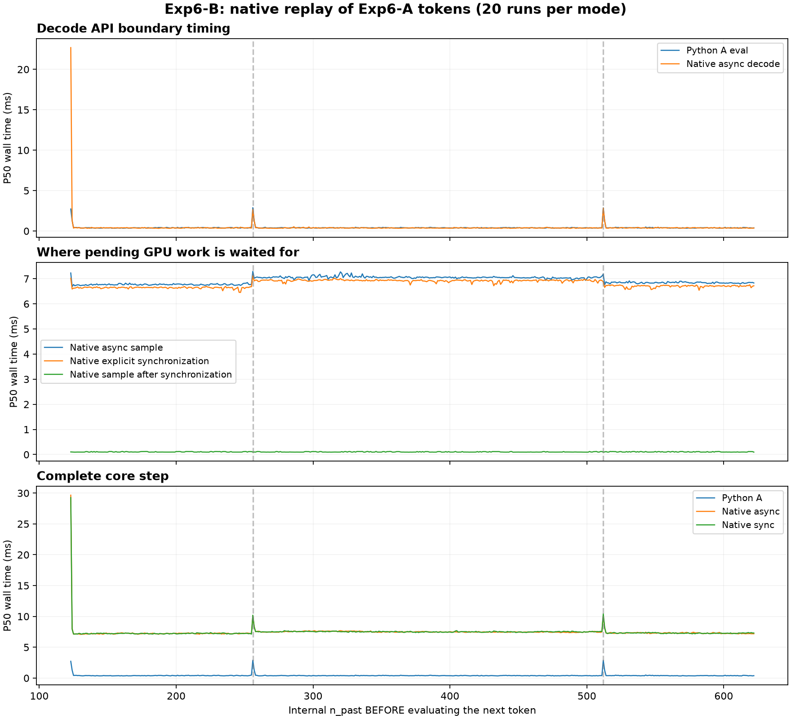
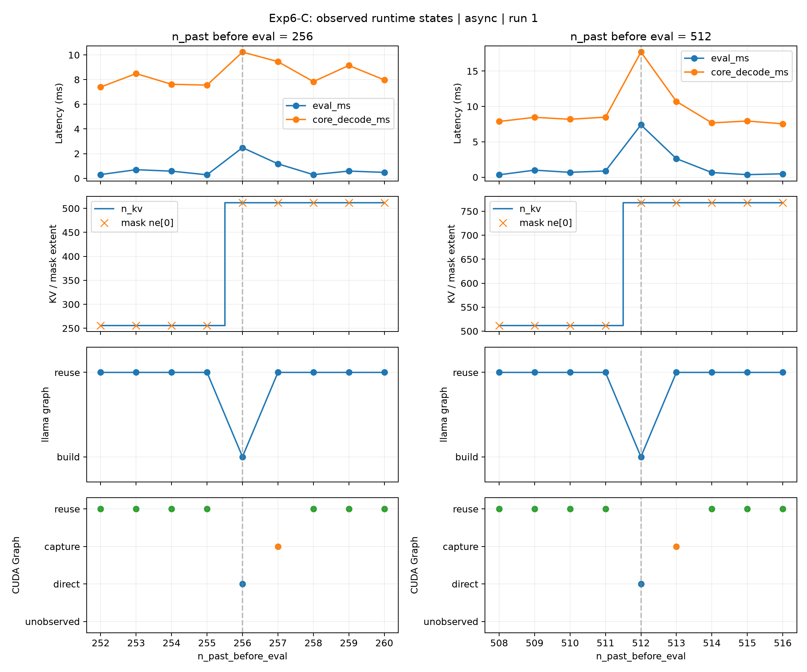

# Experiment 6: Runtime-Layer Validation and Spike Localization

## 1. Research Question

Experiments 2–5 identified reproducible, context-dependent latency spikes in application-observed streaming. At which layer of the local inference stack do these periodic spikes arise, and which internal runtime transitions accompany them?

Experiment 6 follows the evidence from direct Python-binding calls to native C++ decode and finally internal runtime state. The objective is to localize the phenomenon and identify its triggering mechanism in the tested configuration.

## 2. Methodology

- **Hardware & Model:** NVIDIA GeForce RTX 5070 Ti, `Meta-Llama-3-8B-Instruct-Q4_K_M.gguf`.
- **Shared Settings:** GPU offload, `n_ctx=2048`, Flash Attention disabled, and greedy sampling. Native runs use `n_batch=n_ubatch=512` and remaining context settings at native defaults.
- **Workload:** A fixed 123-token prompt, a 5-step warm-up, and 20 measured runs with 500 decode steps per configuration. B and C replay the evaluated token IDs exported from the first A run.
- **Position Alignment:** Decode steps 134 and 390 correspond to `n_past_before_eval = 256` and `512`. This count describes the position before evaluating the next token; it is distinct from the runtime's padded `n_kv`.

| Stage | Measurement Boundary | Purpose |
| :--- | :--- | :--- |
| [Exp6-A: Direct Python Binding](a_python_binding_decode/README.md) | `llm.eval()` and `llm.sample()` | Test whether spikes survive removal of high-level formatting and streaming iteration |
| [Exp6-B: Native Decode](b_native_llama_decode/README.md) | Standalone C++ `llama_decode()`, synchronization, and sampling | Test whether Python is required and separate GPU waiting from sampling |
| [Exp6-C: Runtime State Trace](c_runtime_state_trace/README.md) | KV extent, mask compatibility, llama graph reuse, and CUDA Graph state | Identify the runtime transitions aligned with the spikes |

B links against the installed binding's shared libraries. C uses separate baseline and instrumented builds from the same local source snapshot, compiled with CUDA Toolkit 12.8 for `120a-real`, with CUDA Graphs enabled.

B and C each compare **async** decode followed by sampling with **sync** mode, which inserts `llama_synchronize()` before sampling. C additionally compares uninstrumented baseline and trace variants within each mode.

Spike classification requires latency to exceed a per-run local median within ±3 positions by **both 20% and 0.8 ms**. Neighbor exclusions and reference aggregation are documented in each subexperiment. A's reported component excess uses pooled local references; B and C report median paired excess. These excess statistics should not be treated as interchangeable.

## 3. Observations

### 3.1 Spikes Persist Across Measurement Layers

| Stage / Configuration | Measured Interval | P50 at 256 | P50 at 512 | Spike Rate at Each Boundary |
| :--- | :--- | :--- | :--- | :--- |
| A: Python binding | Eval | 2.890 ms | 2.872 ms | **20/20** |
| B: Native async | Decode | 2.649 ms | 2.835 ms | **20/20** |
| B: Native sync | Decode | 2.713 ms | 3.364 ms | **20/20** |
| C: Baseline async | Decode | 2.864 ms | 3.468 ms | **20/20** |
| C: Trace async | Decode | 3.102 ms | 2.926 ms | **20/20** |
| C: Baseline sync | Decode | 2.952 ms | 3.350 ms | **20/20** |
| C: Trace sync | Decode | 2.693 ms | 3.048 ms | **20/20** |

A retains the periodic spikes after bypassing chat formatting and streaming iteration. B reproduces them without Python in the measured loop. C's uninstrumented builds reproduce them before internal tracing is enabled.

**Observation:** Neither high-level streaming, Python execution, nor instrumentation is required for the boundary spikes to occur. The evidence localizes the reproducible event to the native runtime or below.

The table compares recurrence and position, not equivalent execution costs. Python and native settings, prefill handling, and runtime builds differ; absolute P50 values do not establish a performance ranking between stages.

### 3.2 Sampling Time Includes Pending GPU Work

A's local eval interval is approximately **0.4–0.5 ms**, while sampling occupies roughly **6.7–6.9 ms** near the periodic boundaries. Their combined latency remains around **7–8 ms**.

B's synchronization comparison explains why a short eval interval does not imply an equally short complete token step:

| Tokens Before Eval | Async Sample P50 | Sync-Mode Synchronization P50 | Sync-Mode Sample P50 |
| :--- | :--- | :--- | :--- |
| 256 | 7.293 ms | 7.119 ms | **0.100 ms** |
| 512 | 7.184 ms | 6.882 ms | **0.099 ms** |

Explicit synchronization moves most of the waiting into its own interval, while the periodic decode spikes remain. Async sampling time must therefore not be interpreted as greedy-sampling computation alone.

### 3.3 Shape Transitions Reject Graph Reuse

C records the following sequence in **all 20 runs of both trace modes**:

| Tokens Before Eval | Effective `n_kv` | Mask Shape After Applying the Token | llama Graph | CUDA Graph Path |
| :--- | :--- | :--- | :--- | :--- |
| **256** | **256 → 512** | **`[512, 1, 1, 1]`** | **Rebuild** | **Direct** |
| 257 | 512 | `[512, 1, 1, 1]` | Reuse | Capture |
| 258 | 512 | `[512, 1, 1, 1]` | Reuse | Reuse |
| **512** | **512 → 768** | **`[768, 1, 1, 1]`** | **Rebuild** | **Direct** |
| 513 | 768 | `[768, 1, 1, 1]` | Reuse | Capture |
| 514 | 768 | `[768, 1, 1, 1]` | Reuse | Reuse |

At before-position 256, evaluating the next token requires 257 occupied positions. The runtime expands the padded attention extent to 512, and the existing mask no longer matches. The inspected source explicitly checks this dimension for graph reuse; the trace records the failed check and subsequent rebuild. The same transition occurs at 512, expanding the effective extent to 768.

**KV capacity stays at 2048 throughout both traces.** The observed expansion concerns the effective attention extent and mask shape, not evidence of growing the backing KV allocation.

At each boundary, changed CUDA graph properties reset warm-up and cause direct execution. Capture occurs on the following step, not during the main boundary event. Those capture steps also show additional decode latency: traced P50 is **1.267–1.277 ms at 257** and **2.337–2.438 ms at 513** across the two modes. Capture is observed 20/20 times at each position, even when latency does not meet the spike threshold.

The figure illustrates one run; the state-transition counts and latency summaries cover all 20 runs per mode. Outside first decode and the two periodic boundaries, no llama graph rebuilds are observed in C.

### 3.4 Evidence Quality and Limits

B verifies all **10,000 sampled tokens per mode** against A's exported expectations. C contains **40,000 measured steps** across its four configurations, with consistent replay inputs and position progression. Each trace records **40,040 events with zero dropped events**.

C's four configurations produce identical sampled-token trajectories, but each differs from A at decode step 63 (`n_past_before_eval=185`) in every run. Because replay inputs remain fixed, this does not alter the subsequent workload; it does limit claims of numerical equivalence across runtime builds.

First decode is treated separately from periodic recurrence. Unlike A, B and C do not sample or explicitly synchronize immediately after prefill, so their first measured decode may include pending prefill work.

These results cover one model, device, workload, and configuration. Source inspection and traces identify the shape-related rejection of graph reuse, but API timings do not separate graph construction, scheduler preparation, direct GPU execution, and capture costs. Separate baseline and trace runs also do not isolate instrumentation overhead precisely. The experiment does not establish that mask expansion alone accounts for the entire latency excess.

## 4. Conclusion

Experiment 6 is complete as a **runtime-layer and mechanism-localization study**. A removes high-level streaming as a necessary explanation; B shows that Python is not required; C identifies a reproducible transition from padded KV extent expansion and mask incompatibility to llama graph rebuild and CUDA direct execution, followed by capture on the next step.

The periodic spikes are therefore localized to a specific shape-dependent runtime transition in the tested stack. This conclusion is stronger than position correlation alone because the observed events agree with the source-level reuse conditions.
