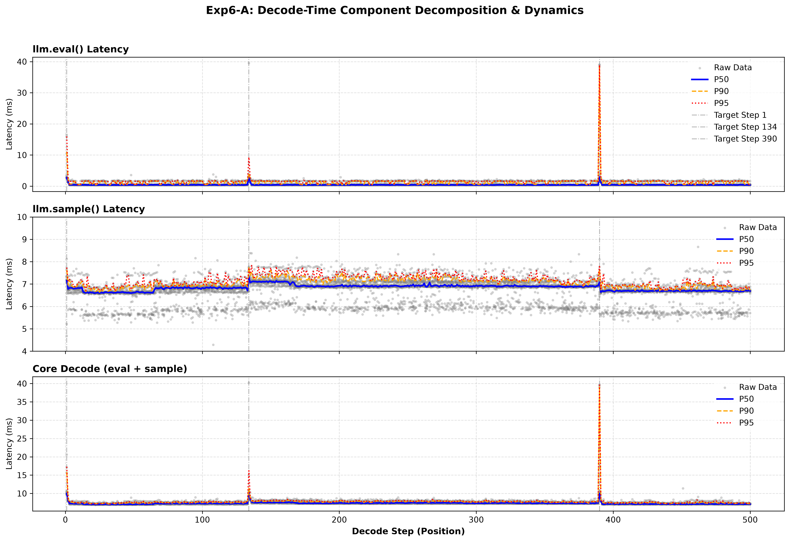

cat << 'EOF' > README_zh.md
# 實驗 6-A：直接 Python 綁定解碼測量

## 1. 研究問題

在實驗 2 至 5 中，我們透過應用程式觀察到的串流測量，發現了可重現且與上下文相關的延遲突刺（latency spikes）現象。當推論過程繞過高階聊天格式化與串流迭代時，這些延遲突刺是否依然存在？

本實驗將測量邊界移至直接的 Python 綁定呼叫，在進一步調查原生執行階段（native runtime）之前，先將 Token 評估（evaluation）與採樣（sampling）分開探討。

## 2. 研究方法

- **硬體與模型：** NVIDIA GeForce RTX 5070 Ti，透過 `llama-cpp-python` 執行 `Meta-Llama-3-8B-Instruct-Q4_K_M.gguf`。
- **配置：** 完全 GPU 卸載，`n_ctx=2048`，停用 Flash Attention，貪婪採樣 (`temperature=0.0`)。
- **工作負載：** 固定長度 123 個 Token 的提示詞（prompt），5 步的暖機（warm-up），以及連續 20 次執行，每次最多進行 500 個解碼步數。
- **測量方式：** 在預填（prefill）與首次採樣之後，交替執行 `llm.eval([token])` 與 `llm.sample()`。使用 `time.perf_counter_ns()` 記錄兩者的持續時間、經過評估/採樣的 Token ID，以及每次評估後 Python 綁定的 Token 數量。

評估前的位置被重建為 `n_past_after_eval - 1`。這測量的是綁定層級的 Token 數量，而非執行階段填充後的 KV 長度。由於提示詞與早期的高階工作負載不同，因此生成步數無法直接互換比較。

針對延遲突刺的分類，每次執行會取目標位置前後 ±3 個位置內的可用相鄰步數中位數（不含目標本身）作為參考值。判定為突刺的條件是必須同時超出此參考值達 **20% 且超過 0.8 毫秒**。組件分析（component analysis）會獨立彙整不同執行次數間的相鄰觀測值，藉此描述局部的延遲水準。

## 3. 觀察結果

### 3.1 在直接評估路徑中，延遲突刺依然存在

| 解碼步數 | 評估前的 Token 數 | 評估 P50 | 彙整局部參考值 | P50 − 參考值 | 突刺發生率 |
| :--- | :--- | :--- | :--- | :--- | :--- |
| 1 | 123 | 2.727 ms | 0.497 ms | +2.230 ms | 20/20 |
| **134** | **256** | **2.890 ms** | **0.476 ms** | **+2.414 ms** | **20/20** |
| **390** | **512** | **2.872 ms** | **0.444 ms** | **+2.428 ms** | **20/20** |

> **注意：** 本表中的局部參考值與超出值採用的是彙整後的組件分析；突刺發生率則採用上述定義的單次執行規則。

這兩個週期性事件發生在綁定的上下文數量達到 256 與 512 之後的 Token 評估期間。兩者的間距恰好是 256 個解碼步。第 1 步被獨立視為首次解碼事件，不作為週期性復發的證據。

**觀察結論：** 移除高階格式化與串流迭代，並不能消除與上下文對齊的延遲突刺現象。

### 3.2 評估與採樣對時間花費有不同的貢獻

| 評估前的 Token 數 | 評估 P50 | 採樣 P50 | 評估 + 採樣 P50 | 局部 評估 + 採樣 參考值 |
| :--- | :--- | :--- | :--- | :--- |
| 256 | 2.890 ms | 7.307 ms | 10.235 ms | 7.504 ms |
| 512 | 2.872 ms | 7.083 ms | 9.976 ms | 7.372 ms |

局部評估延遲大約為 0.4–0.5 毫秒，而在這些邊界附近，採樣大約佔用了 6.7–6.9 毫秒。兩者結合的局部延遲維持在 7–8 毫秒左右，在量級上與早期的高階測量結果一致。

在第一個週期性邊界處，超出彙整參考值的部分分別為：**評估 +2.414 毫秒**、**採樣 +0.418 毫秒**，以及**兩者合併區間 +2.731 毫秒**。因此，該異常現象主要出現在評估路徑中。

這些 P50 差異不具備可加性：`eval + sample` 的中位數不一定等於兩者各自中位數的總和。採樣過程可能也包含了未完成的 GPU 工作或同步操作，因此其測量到的持續時間不能單純解釋為僅有採樣運算。合併後的區間已排除了 Token 轉文字的處理作業與其他高階的額外負擔（overhead）。

## 4. 結論

週期性的延遲突刺在 Token 數量為 256 與 512 的直接 Python 綁定評估中依然存在，且在兩個位置皆具備 **20/20 的重現率**。因此，單靠高階聊天格式化與串流迭代不足以作為此現象的唯一解釋。

本實驗並未將 Python 綁定的額外負擔與原生 llama.cpp 或 CUDA 行為區分開來。這也成為進行實驗 6-B 的動機：透過原生的 C++ 解碼呼叫，來重現相同的 Token 軌跡。