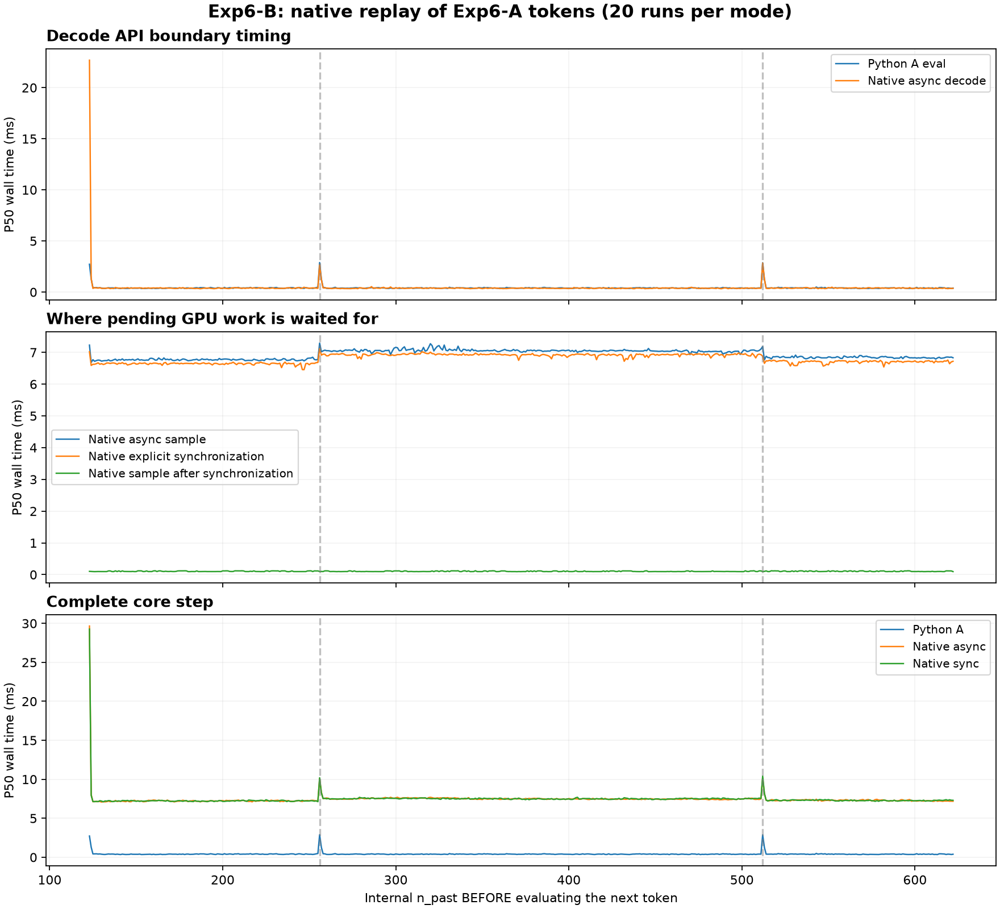

# Experiment 6-B: Native llama.cpp Decode Validation

## 1. Research Question

Experiment 6-A showed that periodic spikes persist in direct Python-binding evaluation. Do they remain when Python is removed from the measured decode loop, and how does explicit synchronization change the timing attributed to sampling?

This experiment moves the measurement boundary to native `llama_decode()` calls using a fixed token replay.

## 2. Methodology

- **Hardware & Model:** NVIDIA GeForce RTX 5070 Ti, `Meta-Llama-3-8B-Instruct-Q4_K_M.gguf`.
- **Configuration:** Full GPU offload requested, `n_ctx=2048`, `n_batch=n_ubatch=512`, Flash Attention disabled; remaining context settings use native defaults.
- **Workload:** A 123-token prompt followed by 500 evaluated tokens, with a 5-step warm-up and 20 sequential runs per mode.
- **Token Replay:** `sequence_export.py` tokenizes the explicitly specified prompt and copies evaluated/expected-next token IDs from the first Exp6-A run into `results/sequence.txt`. Generated text is not re-tokenized.
- **Native Execution:** `run_native.py` compiles `native.cpp` against the installed binding's vendor headers and shared library. The C++ program performs prefill, token replay, and greedy sampling, then writes per-step measurements directly to JSON.

Each measured step separates sequence removal, batch setup, `llama_decode()`, optional synchronization, and sampling. Timing uses `std::chrono::steady_clock`. Sampled tokens are checked against the replay sequence.

Two modes are evaluated independently:
1. **Async:** Decode followed by sampling, without an explicit synchronization call between them.
2. **Sync:** Insert `llama_synchronize()` after decode and before sampling.

Spike classification uses each run's local median over ±3 neighboring positions, excluding the target and other periodic boundaries. A spike must exceed the reference by **both 20% and 0.8 ms**.

## 3. Observations

### 3.1 Periodic Spikes Persist Inside the Native Decode Call

| Mode | Tokens Before Eval | Decode P50 | Local Reference P50 | Median Paired Excess | Spike Rate |
| :--- | :--- | :--- | :--- | :--- | :--- |
| Async | **256** | 2.649 ms | 0.422 ms | **+2.151 ms** | **20/20** |
| Async | **512** | 2.835 ms | 0.401 ms | **+2.387 ms** | **20/20** |
| Sync | **256** | 2.713 ms | 0.435 ms | **+2.253 ms** | **20/20** |
| Sync | **512** | 3.364 ms | 0.433 ms | **+2.674 ms** | **20/20** |

The two boundaries correspond to decode steps 134 and 390. All **10,000 measured steps per mode** match the expected next-token IDs and recorded position progression.

Sequence removal and batch setup each show **0/20 spikes** at both boundaries in both modes. The periodic excess is concentrated in the native decode interval.

**Observation:** Python is not required to reproduce the boundary spikes. They remain visible within the `llama_decode()` call under both timing modes.

> **Statistical Note:** Local Reference P50 is the median of per-run local medians. Median Paired Excess is the median of each run's target-minus-reference difference; it need not equal the difference between the two displayed P50 values.

### 3.2 Explicit Synchronization Separates Waiting from Sampling

| Tokens Before Eval | Async Sample P50 | Sync-Mode Synchronization P50 | Sync-Mode Sample P50 |
| :--- | :--- | :--- | :--- |
| 256 | 7.293 ms | 7.119 ms | **0.100 ms** |
| 512 | 7.184 ms | 6.882 ms | **0.099 ms** |

After explicit synchronization, sampling takes approximately **0.1 ms**, while roughly **7 ms** is measured in the synchronization interval.

This supports the interpretation that the async sampling interval includes substantial waiting for pending GPU work. It should not be treated as the computational cost of greedy sampling alone. The periodic decode spikes remain present after this timing intervention.

### 3.3 First-Decode Behavior and Spike Variability

The first decode has a P50 of **22.688 ms in async mode** and **22.050 ms in sync mode**. Unlike Exp6-A, the current native implementation does not sample or explicitly synchronize immediately after prefill. Its first measured decode can therefore include pending prefill work and is not directly comparable to A's first step. It is excluded from periodic-boundary conclusions.

Spike amplitude also varies substantially: async decode P95 reaches **39.182 ms at 256** and **39.998 ms at 512**. Reproducible positions do not imply a fixed spike cost, and these measurements do not establish an absolute performance advantage over the Python path.

## 4. Conclusion

The periodic spikes reproduce at token positions 256 and 512 within native `llama_decode()`, with **20/20 occurrences in both modes**. This localizes the phenomenon to the native decode path or below in the tested stack, rather than requiring Python-binding or high-level streaming logic.

Explicit synchronization also shows that much of the async sampling interval represents waiting for GPU completion. However, API wall-clock measurements do not identify the underlying runtime, CUDA, or driver event. Native defaults and the prefill-to-decode transition differ from A, so this is a layer-localization experiment rather than an exact timing-equivalence test.

Further internal instrumentation is required to establish the mechanism.