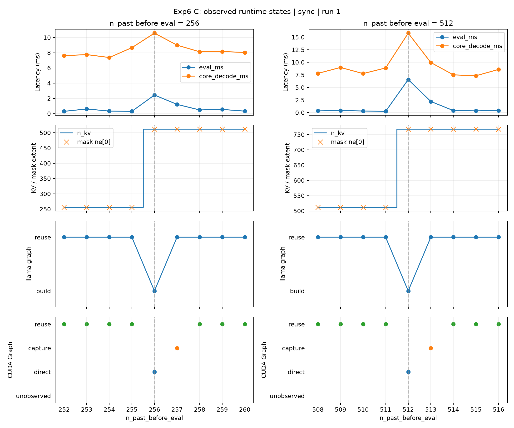

# Experiment 6-C: Internal Runtime State Trace

## 1. Research Question

Experiment 6-B localized the periodic spikes to native `llama_decode()` or below. At `n_past_before_eval = 256` and `512`, do the runtime's effective KV length, attention-mask shape, and graph-reuse state change together?

This experiment aligns internal runtime events with the fixed token replay, distinguishing llama computation-graph reuse from CUDA Graph execution.

## 2. Methodology

- **Hardware & Model:** NVIDIA GeForce RTX 5070 Ti, `Meta-Llama-3-8B-Instruct-Q4_K_M.gguf`.
- **Configuration:** Full GPU offload requested, `n_ctx=2048`, `n_batch=n_ubatch=512`, Flash Attention disabled, greedy sampling; remaining context settings use native defaults.
- **Workload:** The same 123-token prompt and 500-token replay as B, with a 5-step warm-up and 20 sequential measured runs per configuration.
- **Runtime Builds:** Separate uninstrumented baseline and instrumented trace builds from the same local source snapshot, using CUDA Toolkit 12.8, `120a-real`, Release mode, and CUDA Graphs enabled. These are rebuilt libraries, not B's installed binding libraries.
- **Timing Modes:** Async decode followed by sampling, and sync mode with `llama_synchronize()` inserted before sampling. Each mode has its own baseline and trace measurements.
- **Instrumentation:** Record effective padded `n_kv` and cache capacity after applying the token, mask construction and compatibility checks, the llama graph-reuse decision, and CUDA Graph state. Events are buffered in memory and written after measurement.

All four configurations contain **20 × 500 = 10,000 measured steps**. Timing retains B's separation of removal, batch setup, decode, synchronization, and sampling. `core_decode_ms` spans removal through sampling; it is not GPU kernel time alone.

Spike classification uses each run's local median within ±3 positions, excluding the target, first decode, and other 256-token boundaries. A spike must exceed the reference by **both 20% and 0.8 ms**. Median paired excess is computed within each run before aggregation, rather than subtracting independently aggregated medians. The neighboring capture step remains eligible for the boundary's local reference.

## 3. Observations

### 3.1 Boundary Spikes Remain in Both Rebuilt Variants

| Mode | Tokens Before Eval | Baseline Decode P50 | Trace Decode P50 | Trace Median Paired Excess | Decode Spike Rate, Baseline / Trace |
| :--- | :--- | :--- | :--- | :--- | :--- |
| Async | **256** | 2.864 ms | 3.102 ms | **+2.620 ms** | **20/20 / 20/20** |
| Async | **512** | 3.468 ms | 2.926 ms | **+2.448 ms** | **20/20 / 20/20** |
| Sync | **256** | 2.952 ms | 2.693 ms | **+2.337 ms** | **20/20 / 20/20** |
| Sync | **512** | 3.350 ms | 3.048 ms | **+2.656 ms** | **20/20 / 20/20** |

The uninstrumented baseline already reproduces both spikes. Tracing therefore does not introduce their existence or position. Differences between separate baseline and trace runs do not provide a clean estimate of instrumentation overhead, and smaller trace values do not imply a speedup.

In the traced runs, boundary core-decode P50 is **11.08–11.18 ms**, compared with local references of **8.14–8.33 ms**. The event is visible in the complete measured step as well as the native decode interval, although core-decode spike rates are not uniformly 20/20.

### 3.2 KV Extent and Mask Changes Reject Graph Reuse

The following sequence appears in **all 20 runs of both trace modes**:

| Tokens Before Eval | Effective `n_kv` | Mask Shape `ne[0..3]` | llama Graph | CUDA Graph Path |
| :--- | :--- | :--- | :--- | :--- |
| 255 | 256 | `[256, 1, 1, 1]` | Reuse | Reuse |
| **256** | **512** | **`[512, 1, 1, 1]`** | **Rebuild** | **Direct** |
| 257 | 512 | `[512, 1, 1, 1]` | Reuse | Capture |
| 258 | 512 | `[512, 1, 1, 1]` | Reuse | Reuse |
| 511 | 512 | `[512, 1, 1, 1]` | Reuse | Reuse |
| **512** | **768** | **`[768, 1, 1, 1]`** | **Rebuild** | **Direct** |
| 513 | 768 | `[768, 1, 1, 1]` | Reuse | Capture |
| 514 | 768 | `[768, 1, 1, 1]` | Reuse | Reuse |

At each boundary, the mask compatibility check fails in **20/20 runs per mode**, and the llama graph is rebuilt. Outside the first decode and these two boundaries, no llama graph rebuilds are observed.

The inspected source pads the effective KV extent to keep graph shapes stable between boundaries. At before-position 256, evaluating the next token requires 257 occupied positions, so the padded extent becomes 512. The next transition similarly expands 512 to 768. Mask compatibility explicitly requires its first dimension to equal `n_kv`, connecting this shape change to rejection of graph reuse.

**KV capacity remains 2048 throughout both traces.** The observed change is the effective attention extent and mask shape, not evidence of growing the backing KV allocation. Other graph or scheduler allocations were not separately measured.

### 3.3 CUDA Capture Occurs One Step After the Boundary

At 256 and 512, the CUDA trace reports changed graph properties, resets graph warm-up, and executes directly. At 257 and 513, properties are stable, warm-up completes, and capture occurs. Regular CUDA Graph reuse resumes at 258 and 514.

| Mode | Capture Position | Trace Decode P50 | Median Paired Excess | Decode Spike Rate |
| :--- | :--- | :--- | :--- | :--- |
| Async | 257 | 1.277 ms | +0.834 ms | 14/20 |
| Async | 513 | 2.337 ms | +1.961 ms | 20/20 |
| Sync | 257 | 1.267 ms | +0.893 ms | 16/20 |
| Sync | 513 | 2.438 ms | +2.040 ms | 20/20 |

Capture is observed **20/20 times at both positions in each mode**, even when the latency does not satisfy the spike threshold. The transition spans multiple steps: the main boundary spike must not be described as a same-step CUDA capture event. These timings cover the entire decode call, not capture duration in isolation.

The figures show individual runs; tables summarize all 20 runs.

### 3.4 Trace Integrity and Scope

Each trace contains **40,040 events with zero dropped events**. Re-aligning raw events reproduces the saved analysis. All 40,000 measured steps across the four configurations have the expected position progression and replay trajectory.

All four configurations also produce identical sampled-token trajectories. Each differs from A's expected sample at decode step 63 (`n_past_before_eval=185`) in every run: expected token `2317`, sampled token `17571`. The fixed replay continues to feed the recorded input tokens, so this does not change the subsequent workload. It does limit claims of numerical equivalence to the original A/B runtime.

First decode at position 123 and the following capture at 124 are treated separately from periodic recurrence. As in B, there is no explicit synchronization or sample immediately after prefill. Results cover one model, device, workload, and runtime configuration; tracing does not decompose graph construction, scheduler work, or GPU execution costs.

## 4. Conclusion

Exp6-C identifies a reproducible runtime transition associated with the periodic spikes: **padded KV extent expansion changes the attention-mask shape, rejects llama graph reuse, and coincides with CUDA Graph fallback to direct execution, followed by capture on the next step**.

Together with A and B, this supports closing Exp6 as a runtime-layer and mechanism-localization study. The evidence is stronger than token-position correlation alone because the recorded transitions agree with the source-level reuse conditions. However, it does not establish that mask expansion alone accounts for the latency excess, or quantify each downstream component's contribution. Controlled intervention is the next step if the objective becomes causal isolation or latency mitigation.
