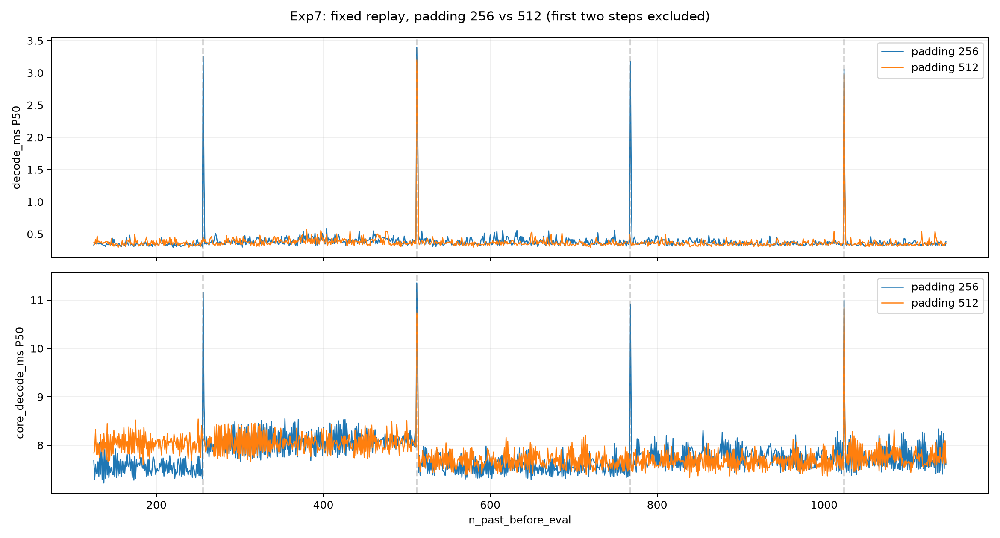
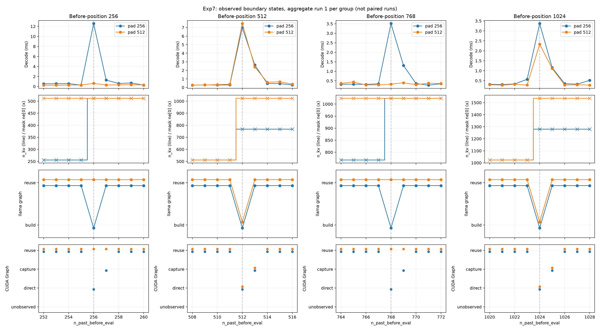

# Experiment 7: Effective Padding Boundary Intervention

## 1. Research Question

Experiment 6 linked periodic latency spikes to effective KV extent expansion, attention-mask shape changes, rejection of llama graph reuse, and a CUDA Graph transition. Does changing the effective padding granularity from **256 to 512** change the spike positions as predicted?

This experiment intervenes on the boundary-setting mechanism. It also records latency costs, but reducing total inference time is not the primary success criterion.

## 2. Methodology

- **Hardware & Model:** NVIDIA GeForce RTX 5070 Ti, `Meta-Llama-3-8B-Instruct-Q4_K_M.gguf`, continuing the Exp6 setup.
- **Configuration:** Full GPU offload requested, `n_ctx=2048`, `n_batch=n_ubatch=512`, Flash Attention disabled, greedy sampling, native async decode followed by sampling.
- **Workload:** One shared 123-token prompt and a fixed replay of **1,024 decode steps**, covering `n_past_before_eval=123–1146`. Sequence export intentionally continues past EOS; this is a controlled replay rather than normal response generation.
- **Runs:** Two batches of 10 measured runs per padding group, giving **20 × 1,024 = 20,480 measured steps per group**. Each process performs a 5-step warm-up before measurement.
- **Runtime Builds:** Both instrumented variants originate from the same local source snapshot. Build caches record CUDA Toolkit 12.8's compiler, `120a-real`, Release mode, and CUDA Graphs enabled.
- **Intervention:** Change only the minimum effective padding in `llama_kv_cache::get_n_kv()` from `std::max(n_pad, 256u)` to `std::max(n_pad, 512u)`. Comparing the two private source trees confirms that this is their only file-content difference. Both retain identical trace hooks.

The runtime reports required padding `n_pad=1`; effective padding is 256 or 512 according to the variant. For this continuous, single-sequence replay, the predicted extent after applying the token is:

```text
n_kv = min(KV capacity, ceil((n_past_before_eval + 1) / padding) × padding)
```

Therefore, padding 256 predicts transitions at **256, 512, 768, 1024**, while padding 512 predicts transitions only at **512, 1024** within the measured range. This changes the effective attention extent, not the allocated KV capacity.

Events are buffered during measurement and aligned with each native step. `decode_ms` measures the host-side `llama_decode()` interval. `core_decode_ms` spans sequence removal, batch setup, decode, and sampling, including pending GPU work waited for during sampling. Neither metric is GPU kernel time alone.

At each target position `p`, analysis also measures the two-step window **p and p+1**, covering the boundary and subsequent capture. Its local reference uses stable positions within `[p−3, p+4]`, excluding all target windows, the first two steps, and observed runtime-event positions from either group. Two-step excess is computed per run before taking the median:

```text
latency[p] + latency[p+1] − 2 × local median
```

A target-step spike must exceed its local reference by **both 20% and 0.8 ms**. State transitions are checked independently of this timing threshold.

## 3. Observations

### 3.1 Spike Positions Follow the Padding Intervention

| Tokens Before Eval | Padding 256 Decode P50 | Padding 512 Decode P50 | Decode Spike Rate, 256 / 512 | KV/Mask Transition Rate, 256 / 512 |
| :--- | :--- | :--- | :--- | :--- |
| **256** | 3.257 ms | **0.453 ms** | **20/20 / 0/20** | **20/20 / 0/20** |
| **512** | 3.395 ms | 3.201 ms | **20/20 / 20/20** | **20/20 / 20/20** |
| **768** | 3.171 ms | **0.404 ms** | **20/20 / 0/20** | **20/20 / 0/20** |
| **1024** | 3.060 ms | 2.973 ms | **20/20 / 20/20** | **20/20 / 20/20** |

The core-decode spike classification gives the same rates at these four positions. Padding 512 removes the events at 256 and 768 while retaining those at 512 and 1024. The observed recurrence doubles from 256 to 512 tokens; the spikes do not simply become smaller at unchanged positions.



The curves show per-position P50 across 20 runs per group, excluding the first two decode steps.

### 3.2 The Runtime Transition Moves with the Spike

| Tokens Before Eval | Padding 256 Effective `n_kv` | Padding 512 Effective `n_kv` | llama Graph, 256 / 512 | CUDA Path, 256 / 512 |
| :--- | :--- | :--- | :--- | :--- |
| **256** | **256 → 512** | 512 → 512 | Rebuild / Reuse | Direct / Reuse |
| **512** | **512 → 768** | **512 → 1024** | Rebuild / Rebuild | Direct / Direct |
| **768** | **768 → 1024** | 1024 → 1024 | Rebuild / Reuse | Direct / Reuse |
| **1024** | **1024 → 1280** | **1024 → 1536** | Rebuild / Rebuild | Direct / Direct |

Every listed transition occurs in **20/20 runs**. The attention mask has shape `[n_kv, 1, 1, 1]`; its compatibility check fails when the extent changes. CUDA capture follows one step later, with reuse resuming on the next step. At 256 and 768, padding 512 preserves both graph-reuse paths and requires no following capture.

Outside the initial two-step transient, the complete traces contain no additional transition positions beyond these boundary/capture pairs. **KV capacity remains 2048 in both groups**, and every observed extent matches the padding prediction.



This figure shows aggregate run 1 from each group, not paired measurements. Tables summarize all 20 runs; individual-run latency amplitudes can differ substantially from the aggregate P50.

### 3.3 The Removed Events Do Not Reappear as Next-Step Capture

| Tokens Before Eval | Two-Step Decode Excess, Padding 256 | Two-Step Decode Excess, Padding 512 | Two-Step Core Excess, Padding 256 | Two-Step Core Excess, Padding 512 |
| :--- | :--- | :--- | :--- | :--- |
| 256 | +3.776 ms | **+0.098 ms** | +4.873 ms | **+0.197 ms** |
| 512 | +4.691 ms | +4.793 ms | +5.505 ms | +5.658 ms |
| 768 | +3.588 ms | **+0.072 ms** | +4.371 ms | **+0.125 ms** |
| 1024 | +3.555 ms | +3.229 ms | +4.149 ms | +3.791 ms |

These are medians of within-run excesses, not differences between independently aggregated medians. The near-zero excess at 256 and 768 agrees with the disappearance of both the boundary transition and its following capture. At retained boundaries, the two-step cost remains substantial.

### 3.4 Lower Decode-Call Time Does Not Establish Overall Acceleration

| Metric | Padding 256 | Padding 512 | Change |
| :--- | :--- | :--- | :--- |
| Per-run sum of `decode_ms`, P50 | 487.610 ms | 465.516 ms | **−4.53%** |
| Per-run sum of `core_decode_ms`, P50 | 8091.074 ms | 8127.046 ms | **+0.44%** |
| Stable-position `core_decode_ms`, pooled P50 | 7.755 ms | 7.798 ms | **+0.55%** |

Per-run totals cover all 1,024 measured steps, including the initial transient. They exclude separately timed prefill and are not complete application wall-clock measurements; residual prefill work may contribute to the first async step. Stable-position statistics use the same excluded-position set for both groups.

The cumulative decode-call interval decreases, but the complete measured core interval does not. Using means for additive decomposition, padding 512 reduces decode time by **22.014 ms per run**, while sampling time increases by **67.714 ms**; mean total core time increases by **45.676 ms**, including the remaining small components. Sampling includes GPU waiting, so this is not evidence that the sampling algorithm itself became slower.

The early stable region illustrates the tradeoff: at before-positions **125–255**, padding 512 already uses an extent of 512 rather than 256. Pooled core P50 is **8.014 ms versus 7.512 ms**. Larger extents can change ordinary-step work as well as graph behavior, although these timings alone do not isolate the source of the difference. Latency is not uniformly lower or higher across the remaining context regions.

Batch-level core-total P50 values are **8093.369 / 8084.749 ms** for padding 256 and **8102.946 / 8151.311 ms** for padding 512. The saved records do not establish randomized or counterbalanced execution order, and no clock or temperature telemetry was saved. The small overall difference should therefore remain descriptive rather than a claim of a general performance regression or improvement.

### 3.5 Replay Integrity and Sampled-Token Differences

Re-aligning all four raw traces reproduces the saved analysis steps and target statistics. All 40 measured runs share identical prompt tokens, evaluated-token sequences, expected-token sequences, context settings, and warm-up counts, and agree with `results/sequence.txt`.

Each padding-256 batch contains **51,240 events**; each padding-512 batch contains **51,220 events**. All have **zero dropped events**. There are no padding-extent mismatches or within-group sampled-token variations.

However, the two groups differ at four sampled-token positions:

| Decode Step | Tokens Before Eval | Padding 256 / Exporter Token | Padding 512 Token |
| :--- | :--- | :--- | :--- |
| 461 | 583 | 1359 | 498 |
| 578 | 700 | 264 | 323 |
| 596 | 718 | 701 | 279 |
| 869 | 991 | 358 | 374 |

Each difference appears in all 20 padding-512 runs, giving **80 mismatching step records** against the exporter reference. Padding 256 matches the reference throughout. Both variants still evaluate the same fixed input tokens, so these sample differences do not change the replay workload. They do prevent a claim of identical greedy outputs; logits and task quality were not evaluated.

## 4. Conclusion

**Changing effective padding from 256 to 512 changes the recurrence of the observed boundary spikes and associated runtime transitions exactly as predicted.** The disappearance of both timing spikes and state transitions at 256 and 768 provides intervention-based evidence that the effective-padding boundary controls this periodic mechanism in the tested configuration.

Together with Exp6, the evidence supports the chain from effective KV extent expansion to mask-shape incompatibility, llama graph rebuilding, CUDA direct execution, and next-step capture. It does not isolate the latency contribution of each component, demonstrate backing KV allocation growth, or establish mask construction alone as the cost.

The intervention halves the number of periodic boundary transitions in this replay, but **does not demonstrate an overall speedup**. Both variants are instrumented, and their event frequencies differ; an uninstrumented performance comparison would be needed to assess deployment benefits. Results remain specific to one model, device, replay, and Flash-Attention-disabled configuration. The primary Exp7 question is answered; performance optimization and numerical-equivalence evaluation remain separate questions.
